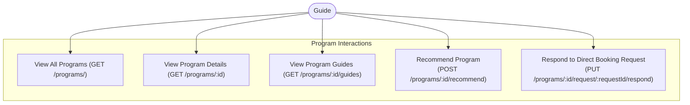
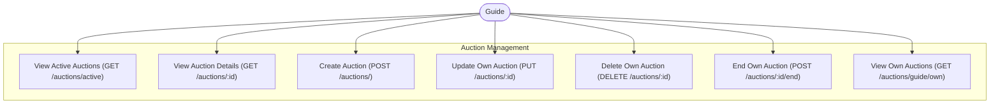
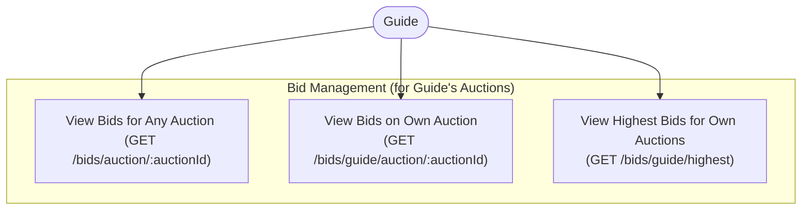

## Tab 1: User Management

## Tab 2: Guide Profile & Settings

## Tab 3: Program Interactions

## Tab 4: Auction Management

## Tab 5: Bid Management (for Guide's Auctions)

## Tab 6: Booking Management (for Guide's Services)

## Tab 7: Payment & Token Management

## Tab 8: Information Viewing

