## Guide Screens

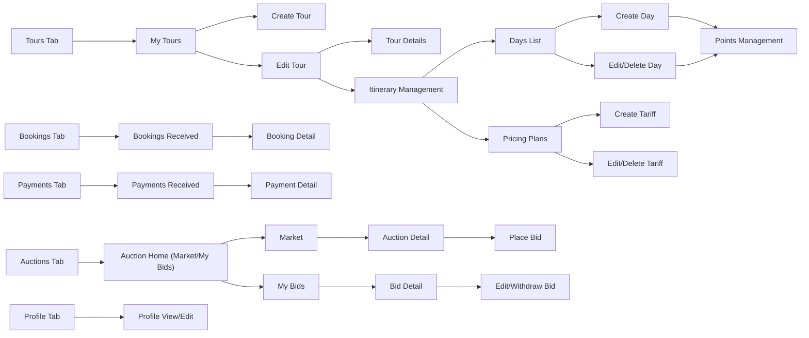

## Guide API Flows

### 1. Guide Profile & Setup
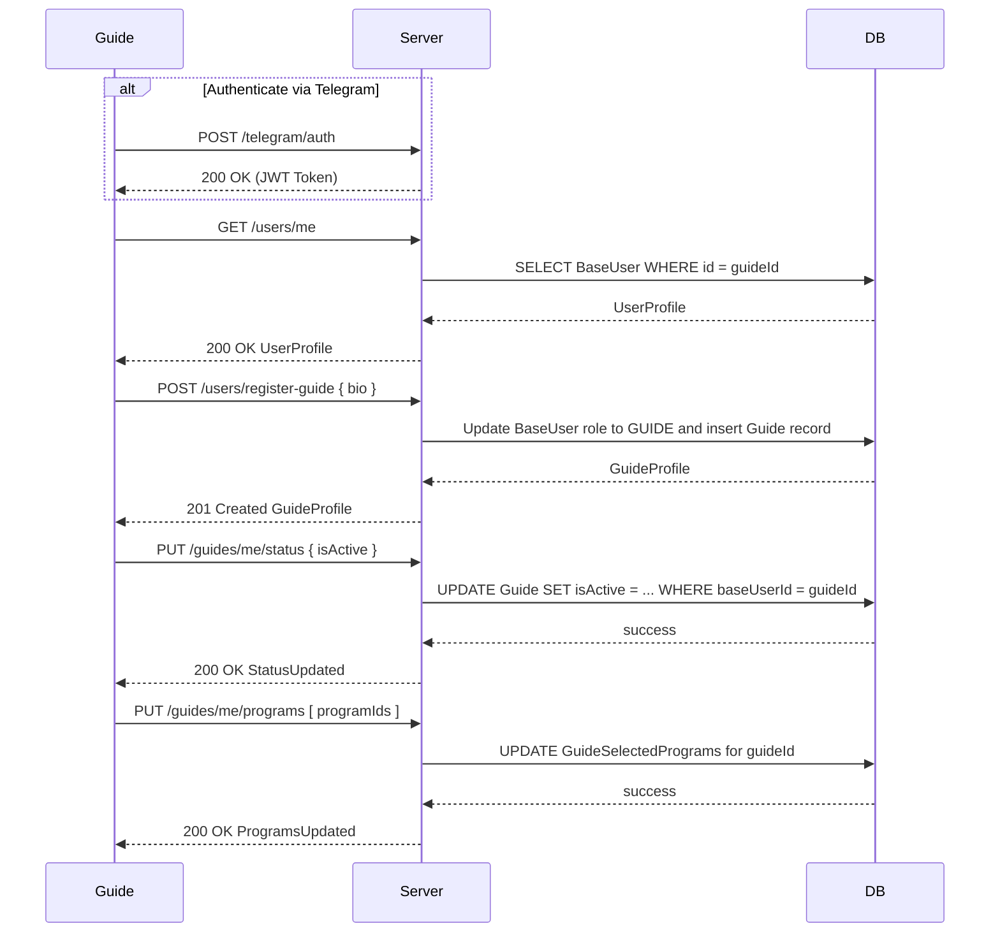

### 2. Programs Management
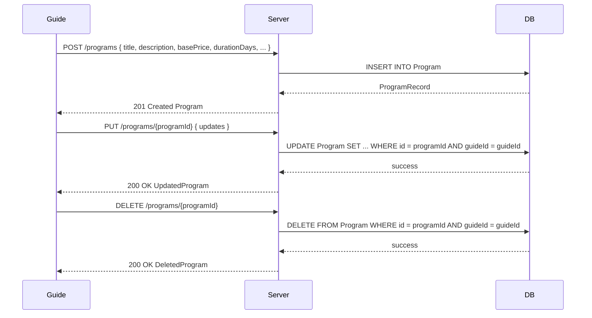

### 3. Program Days & Points
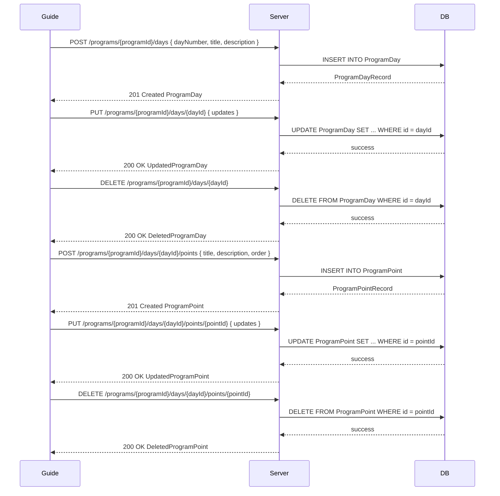

### 4. Direct Booking Requests
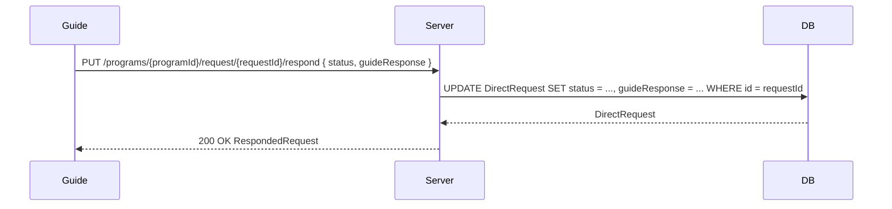

### 5. Program Recommendations
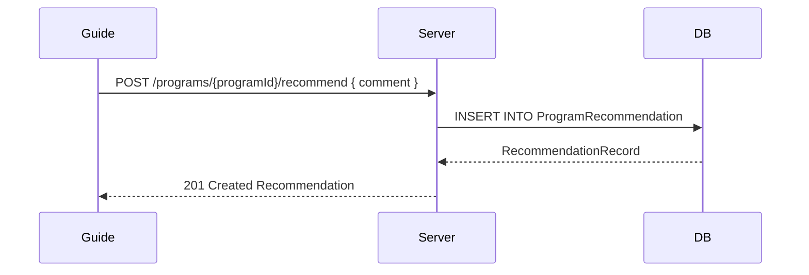

### 6. Auction Management
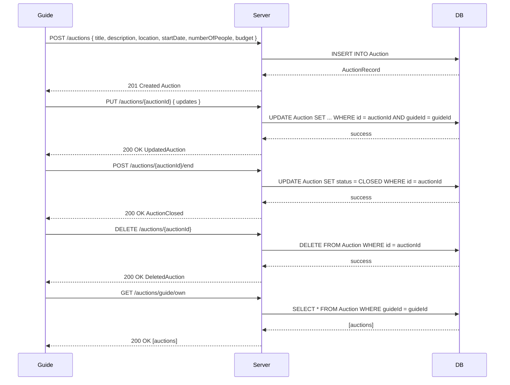

### 7. Bids Management
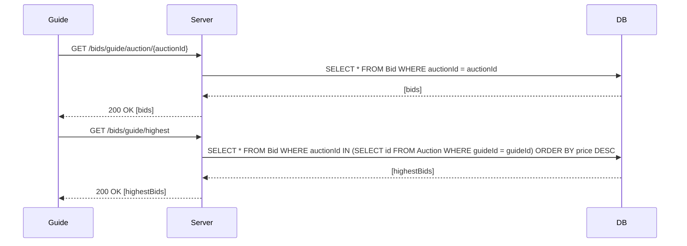

### 8. Tariff Management
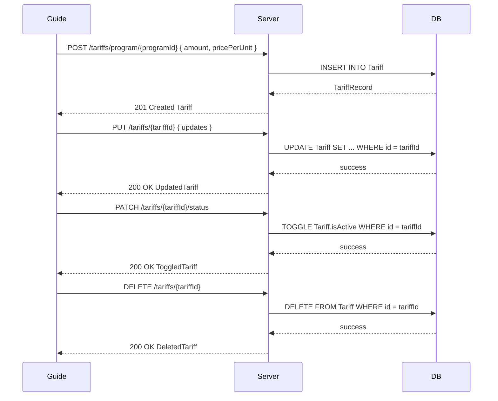

### 9. Token Payments
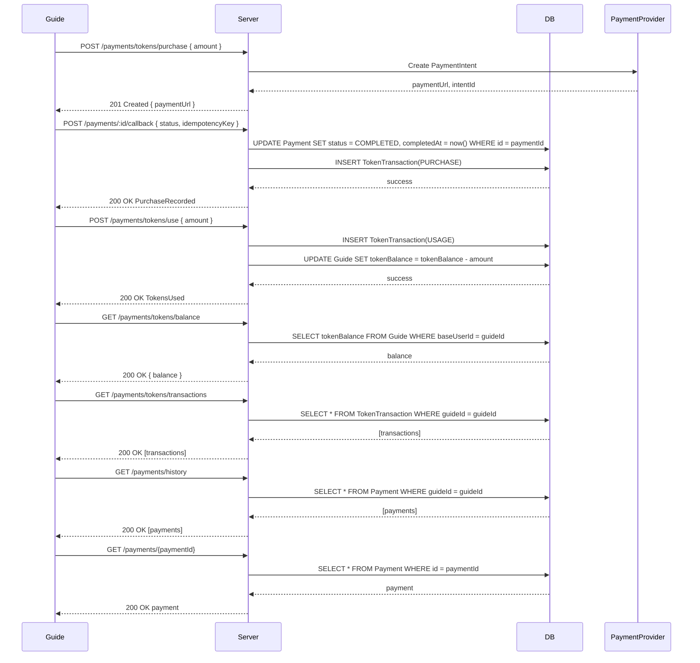

### 10. Booking Status Updates
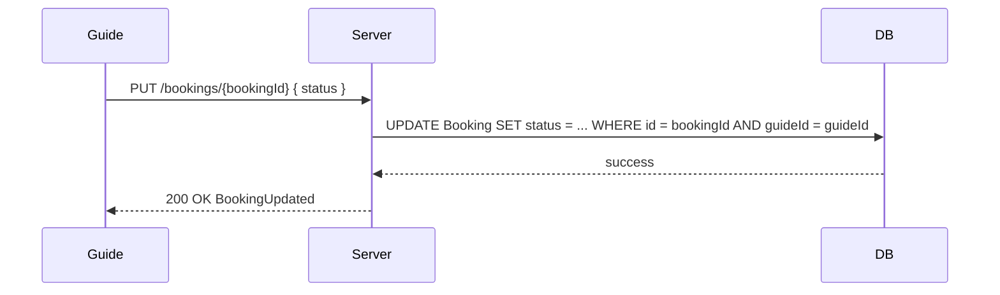

### 11. View Reviews
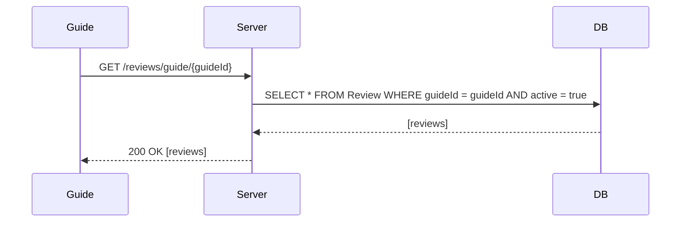