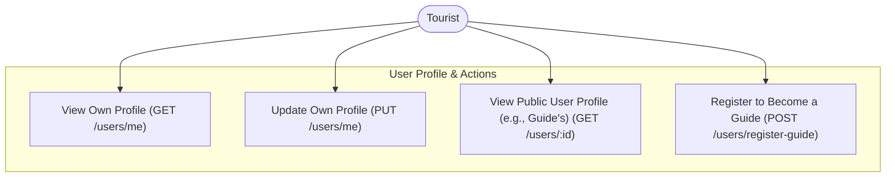
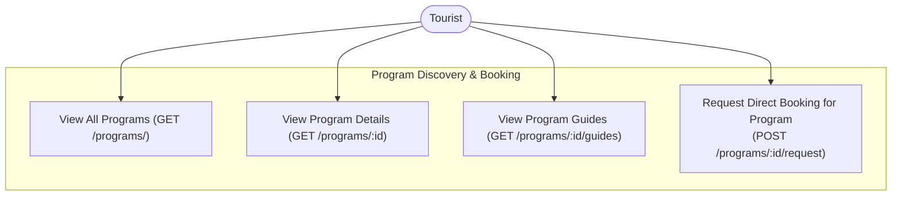
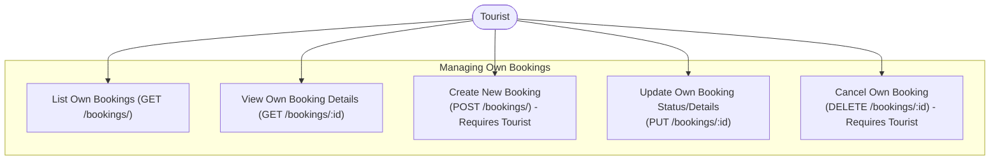
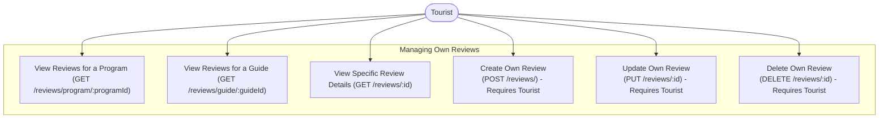
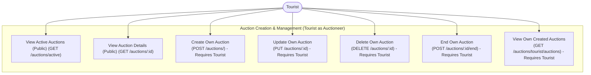
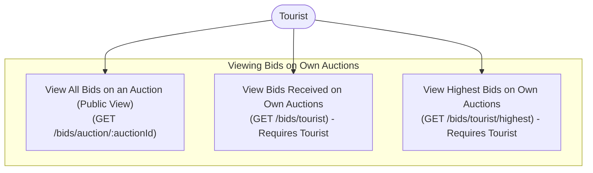
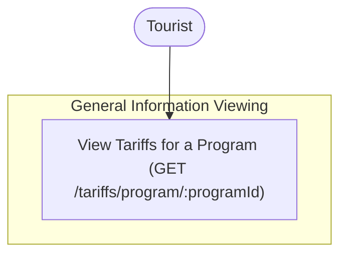

## Tab 1: User Profile & Actions

## Tab 2: Program Discovery & Booking

## Tab 3: Managing Own Bookings

## Tab 4: Managing Own Reviews

## Tab 5: Auction Creation & Management (Tourist as Auctioneer)

## Tab 6: Viewing Bids on Own Auctions

## Tab 7: General Information Viewing

