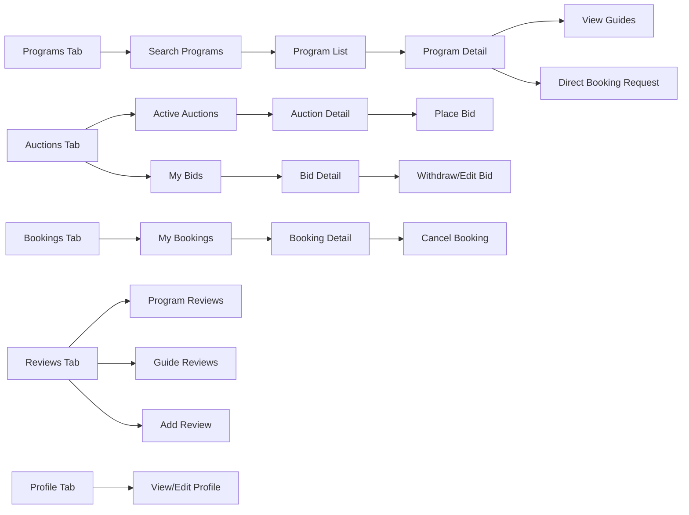
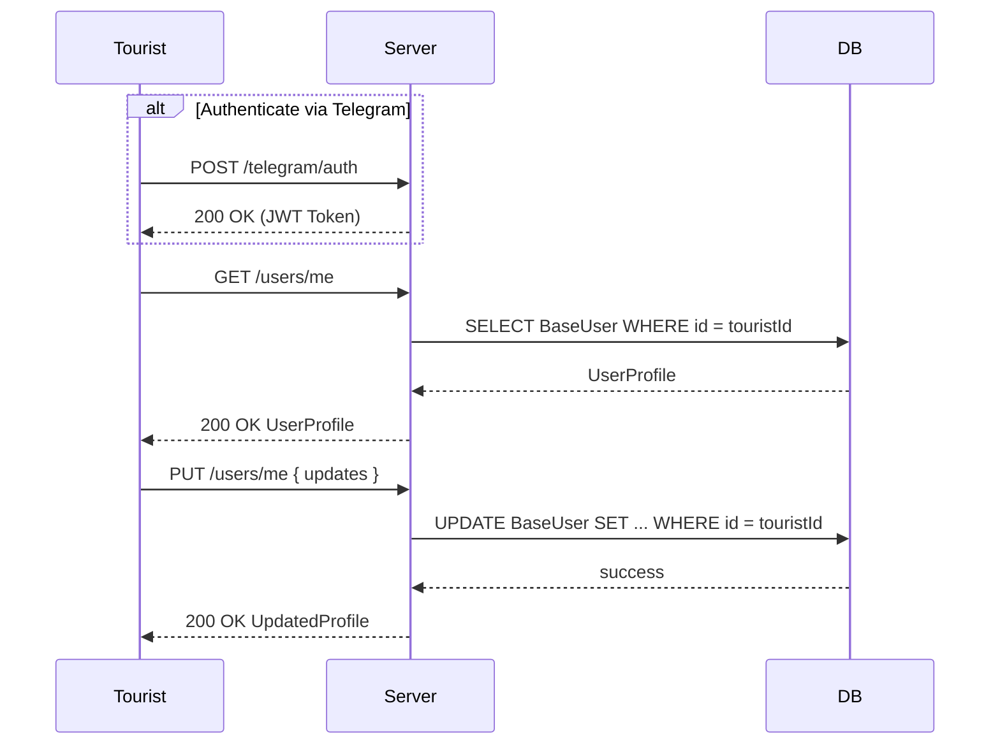
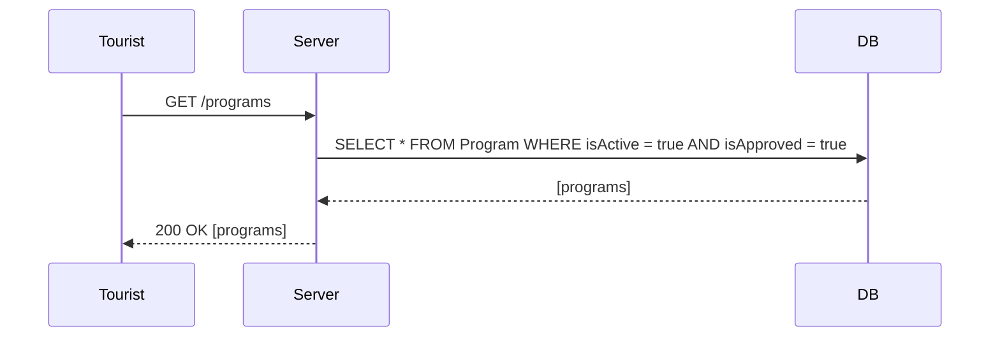
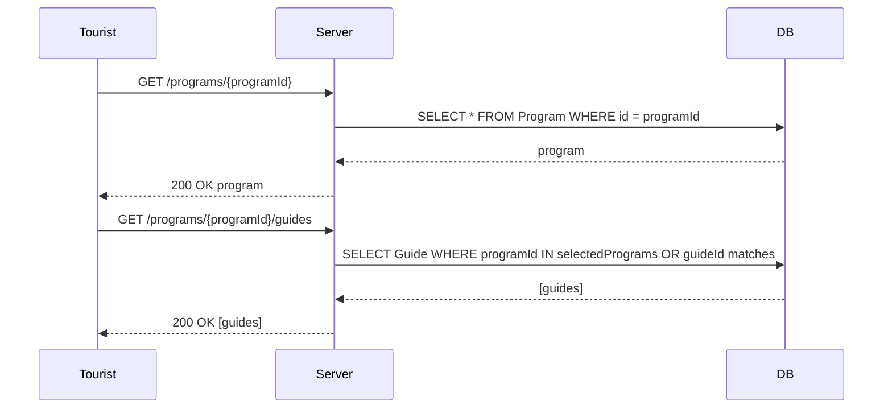
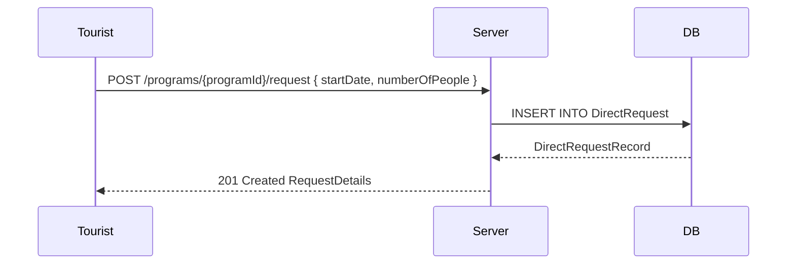
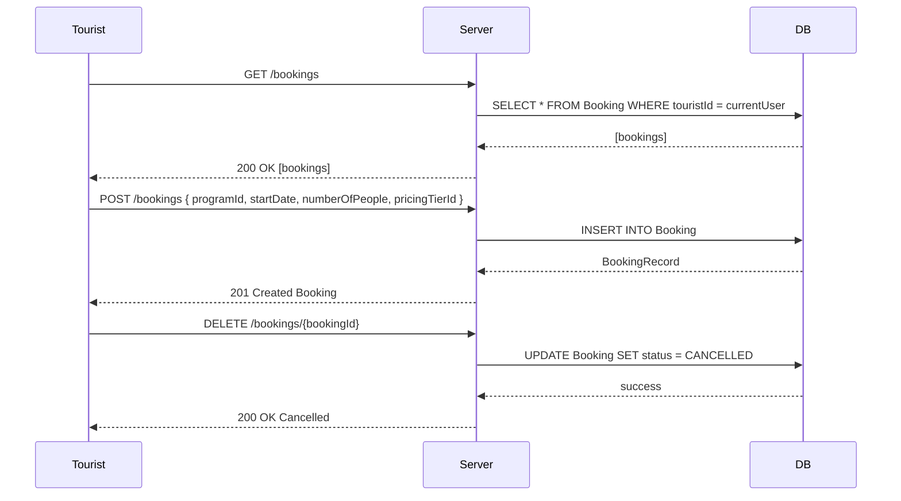
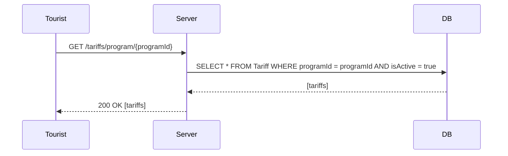
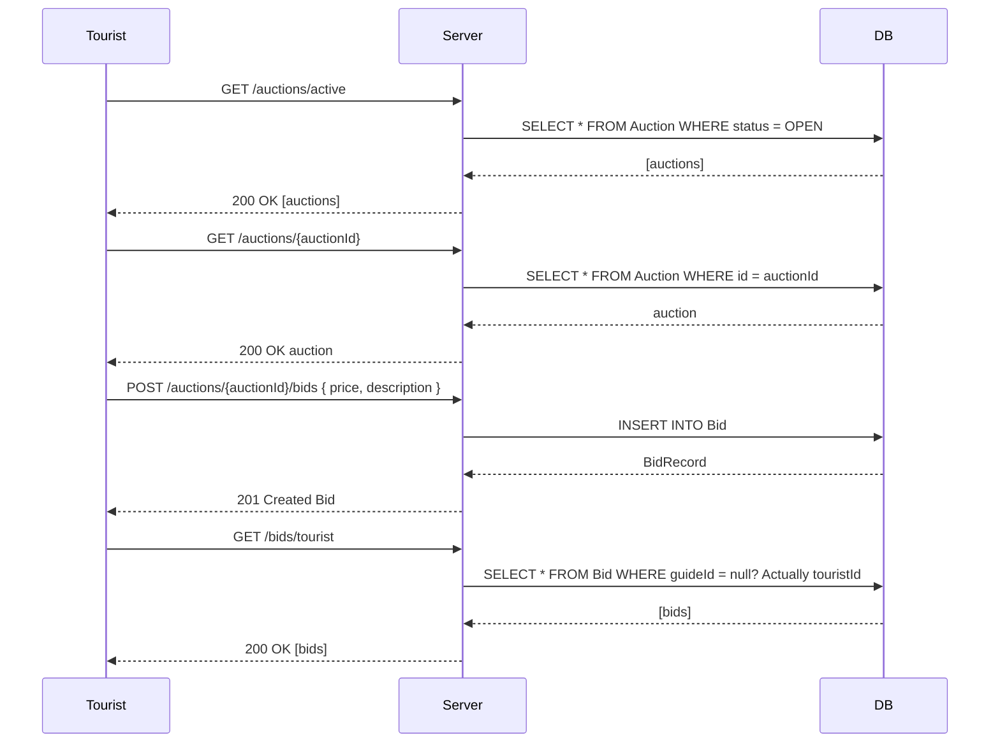

## Tourist Screens



## Tourist API Flows

### 1. User Profile & Authentication


### 2. Search Programs


### 3. View Program Details & Guides


### 4. Direct Booking Request


### 5. Manage Bookings


### 6. View Tariffs


### 7. Auction & Bidding


### 8. Reviews
```mermaid
sequenceDiagram
    participant Tourist
    participant API as Server
    participant DB
    Tourist->>API: GET /reviews/program/{programId}
    API->>DB: SELECT * FROM Review WHERE programId = programId AND active = true
    DB-->>API: [reviews]
    API-->>Tourist: 200 OK [reviews]
    Tourist->>API: POST /reviews { programId, guideId, rating, comment }
    API->>DB: INSERT INTO Review
    DB-->>API: ReviewRecord
    API-->>Tourist: 201 Created Review
  ```